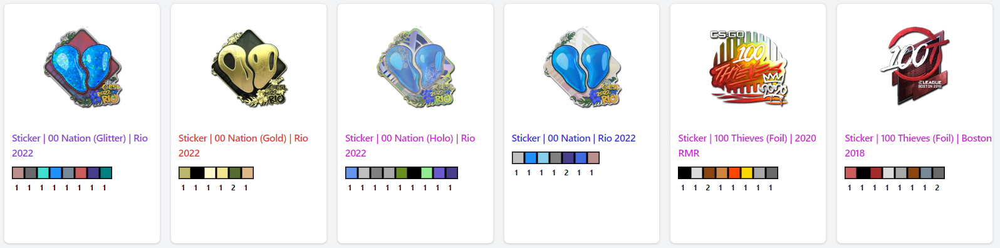
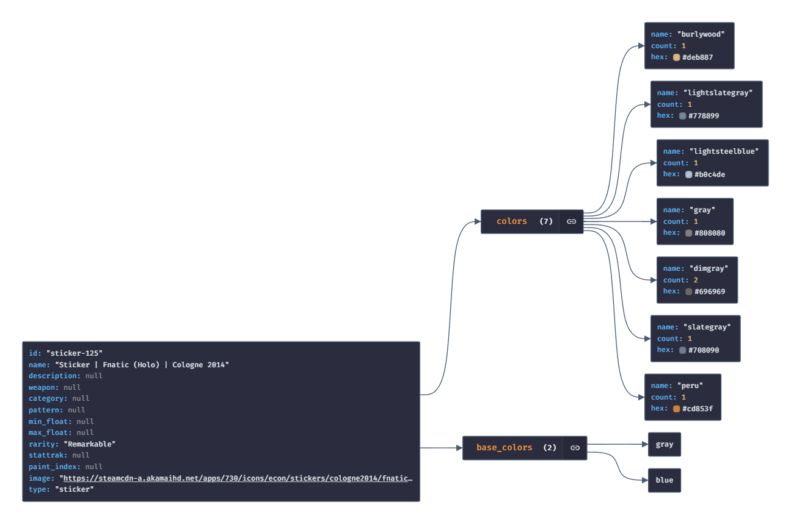

# cscolors extractor

Extracts colors of all CSGO/CS2 skins and stickers. 

All item data is fetched from https://github.com/ByMykel/CSGO-API. The colors are extracted with colorthief and written to a json file together with the provided item data.


Displaying the colors/items is not part of this project, this is just an example.

## Usage
You can install the requirements with the following command
```
pip3 install -r requirements.txt
```
After that you can run

```
python3 src/main.py
```
to extract all the item colors and save them to json files. Note that this might take a while.

## Result
The script will create 2 files
- skins.json
- sticker.json

These will contain all the item data + the extracted colors.

A single item entry looks like this:
